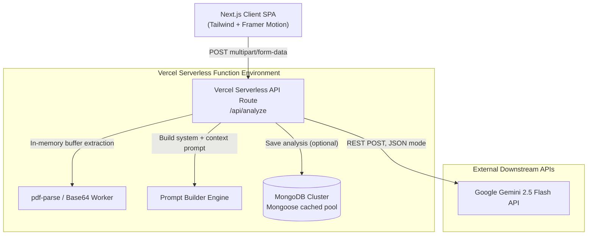
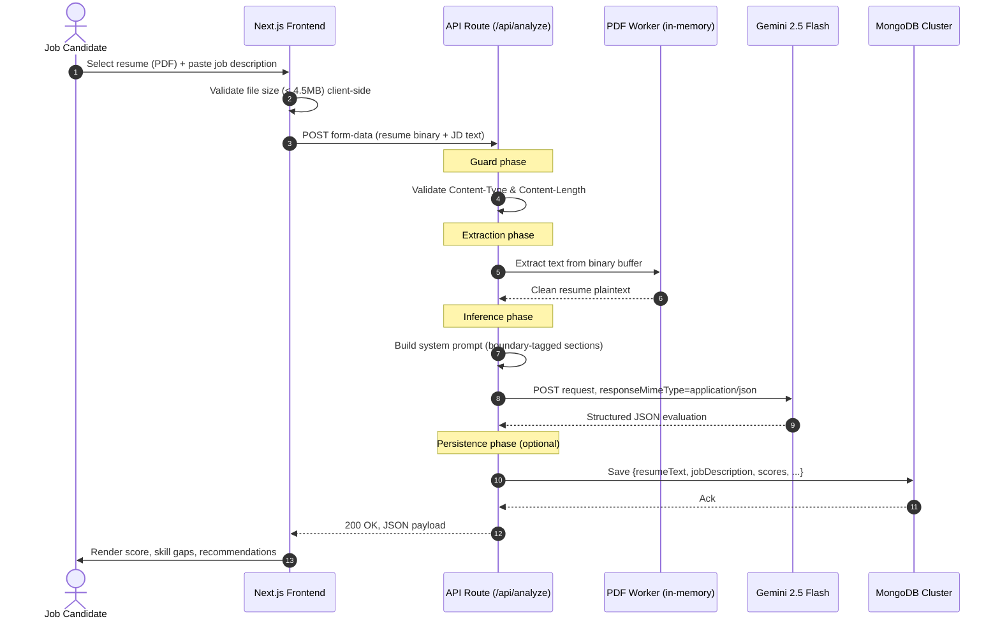
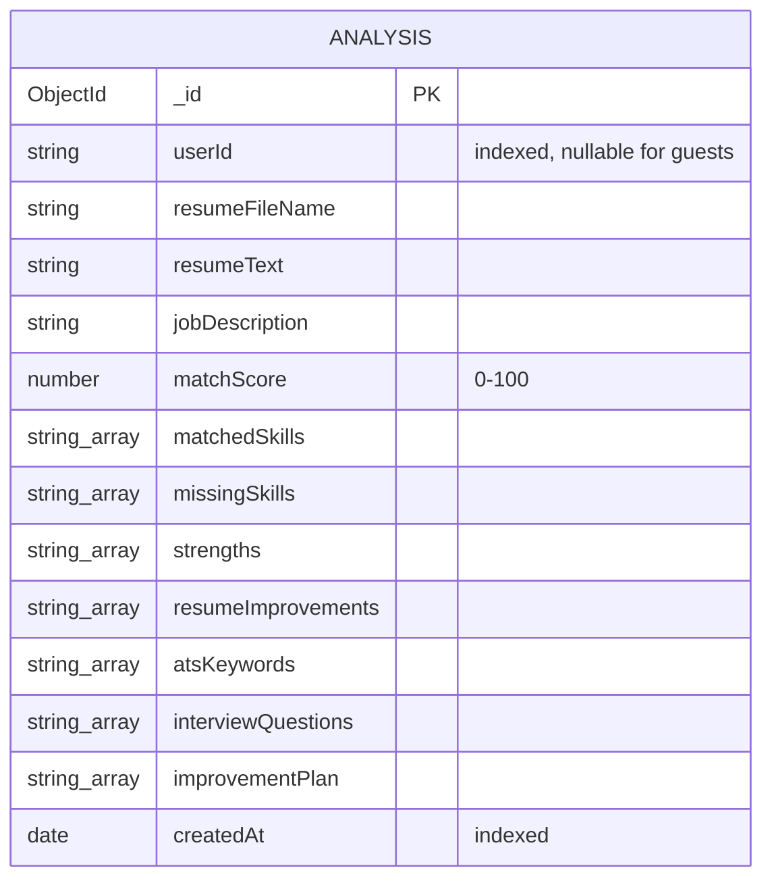
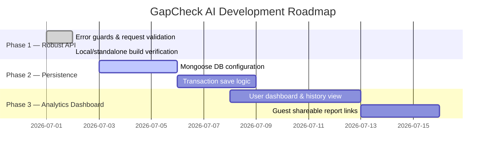
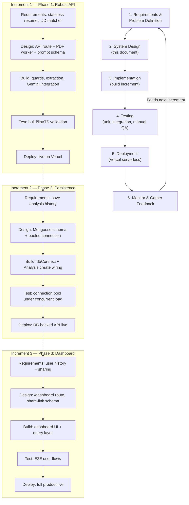

# GapCheck AI — System Design Document

**Enterprise-ready Resume Evaluation & ATS Matching SaaS Platform**
Stack: Next.js (Serverless) · Google Gemini 2.5 Flash · MongoDB (Mongoose) · Tailwind + Framer Motion

---

## 1. Overview

GapCheck AI takes a candidate's resume (PDF) and a target job description, extracts the resume text server-side, sends both to an LLM under a strict JSON schema, and returns a structured match analysis: score, matched/missing skills, resume improvement suggestions, ATS keywords, interview questions, and an improvement plan.

**Design paradigm: Serverless-first, stateless-by-default.**

| Principle | Why |
|---|---|
| Serverless execution (Vercel functions) | Zero server maintenance, auto-scale on traffic spikes |
| In-memory file processing | No disk I/O — avoids serverless filesystem/ephemeral-storage issues |
| Structured AI output (`responseMimeType: application/json`) | Deterministic, parseable responses — no regex scraping of LLM prose |
| Early payload/size guards | Avoids Vercel's 4.5MB request body limit and 10s timeout on free tier |

---

## 2. System Architecture



**Component responsibilities**

- **Client SPA** — file picker + JD textarea, client-side size validation, renders returned analytics.
- **API Route (`/api/analyze`)** — single orchestration point: validate → extract → prompt → infer → (optionally) persist → respond.
- **PDF Worker** — extracts plaintext from the uploaded PDF buffer without touching disk.
- **Prompt Builder** — wraps resume text and JD in structural boundary tags, enforces output schema.
- **Gemini 2.5 Flash** — returns structured JSON evaluation.
- **MongoDB** — optional persistence layer for history/dashboards (Phase 2+).

---

## 3. Request/Response Flow (Sequence Diagram)



---

## 4. Database Design (MongoDB / Mongoose)

The app currently runs **stateless**. The schema below is the production design for enabling history, dashboards, and audit logging.

### 4.1 Connection Pooling (Serverless-Safe)

Serverless functions spin up/down per request. Creating a fresh Mongoose connection each time exhausts the DB's connection socket limit. The fix: cache the connection on Node's `global` object so warm invocations reuse it.

```typescript
// src/app/lib/db.ts
import mongoose from "mongoose";

const MONGODB_URI = process.env.MONGODB_URI;
if (!MONGODB_URI) throw new Error("MONGODB_URI is not defined");

interface GlobalMongoose {
  conn: typeof mongoose | null;
  promise: Promise<typeof mongoose> | null;
}

declare global {
  var mongoose: GlobalMongoose | undefined;
}

let cached = globalThis.mongoose ?? (globalThis.mongoose = { conn: null, promise: null });

async function dbConnect() {
  if (cached.conn) return cached.conn;

  if (!cached.promise) {
    const opts = {
      bufferCommands: false,
      maxPoolSize: 10,             // capped for serverless
      serverSelectionTimeoutMS: 5000,
    };
    cached.promise = mongoose.connect(MONGODB_URI!, opts).then((i) => i);
  }

  try {
    cached.conn = await cached.promise;
  } catch (e) {
    cached.promise = null;         // reset on failure so next call retries cleanly
    throw e;
  }
  return cached.conn;
}

export default dbConnect;
```

### 4.2 Entity: `Analysis`



```typescript
// src/app/models/Analysis.ts
import mongoose, { Schema, Document, Model } from "mongoose";

export interface IAnalysis extends Document {
  userId?: string;
  resumeFileName?: string;
  resumeText: string;
  jobDescription: string;
  matchScore: number;
  matchedSkills: string[];
  missingSkills: string[];
  strengths: string[];
  resumeImprovements: string[];
  atsKeywords: string[];
  interviewQuestions: string[];
  improvementPlan: string[];
  createdAt: Date;
}

const AnalysisSchema: Schema = new Schema(
  {
    userId: { type: String, required: false, index: true },
    resumeFileName: { type: String, required: false },
    resumeText: { type: String, required: true },
    jobDescription: { type: String, required: true },
    matchScore: { type: Number, required: true, min: 0, max: 100 },
    matchedSkills: [{ type: String }],
    missingSkills: [{ type: String }],
    strengths: [{ type: String }],
    resumeImprovements: [{ type: String }],
    atsKeywords: [{ type: String }],
    interviewQuestions: [{ type: String }],
    improvementPlan: [{ type: String }],
    createdAt: { type: Date, default: Date.now, index: true },
  },
  { versionKey: false, timestamps: false }
);

const Analysis: Model<IAnalysis> =
  mongoose.models.Analysis || mongoose.model<IAnalysis>("Analysis", AnalysisSchema);

export default Analysis;
```

**Indexing rationale:** `userId` supports fast "my history" queries; `createdAt` supports time-bounded queries ("last 30 days") for a future dashboard. For guest-mode deduplication, a resume MD5 hash field is planned (Phase 2 backlog).

---

## 5. Key Engineering Decisions

### 5.1 Serverless PDF Parsing (No Disk I/O)
**Problem:** Standard PDF libraries load worker scripts (`pdf.worker.js`) from disk relative to `process.cwd()`. Vercel's serverless bundler strips `node_modules` into micro-bundles, so this throws `FileNotFound` / crashes with 500.

**Solution:** Load the worker as an in-memory Base64 data URI — zero filesystem dependency.

```typescript
import { getData } from "pdf-parse/worker";
PDFParse.setWorker(getData());
```

### 5.2 Bundler Exclusions for Native Modules
**Problem:** Webpack/Turbopack try to pack `@napi-rs/canvas` (used by `pdfjs-dist`) into the server bundle. It ships architecture-specific `.node` binaries, which breaks the build.

**Solution:** Mark these packages external so the compiler imports them natively instead of bundling.

```typescript
// next.config.ts
const nextConfig: NextConfig = {
  serverExternalPackages: ["pdf-parse", "@napi-rs/canvas"],
};
```

---

## 6. Security, Validation & Limits

| Boundary | Risk | Mitigation |
|---|---|---|
| **Payload size** | Vercel functions fail (413/500) above 4.5MB | Client-side pre-check + server-side early `Content-Length` guard |
| **Execution timeout** | 10s limit on free-tier Lambdas | Buffer-based PDF parsing, `gemini-2.5-flash` for speed, strict JSON mode to cut generation time |
| **Malformed/encrypted PDFs** | Extraction throws, fails whole route | Wrapped extraction in `try/catch` → clean `422 Unprocessable Entity` instead of `500` |
| **Prompt injection via JD text** | User-supplied JD could contain "ignore previous instructions..." | Structural boundary tags (`CANDIDATE RESUME:` / `JOB DESCRIPTION:`) + enforced output schema isolates instruction scope from data scope |

---

## 7. Roadmap



### Phase 1 — Robust API & Validation ✅
- [x] Early request-size / content-type guards
- [x] Non-blocking, in-memory PDF extraction
- [x] Bundler exclusions for native packages
- [x] Lint, TS compile, Turbopack build validation

### Phase 2 — Persistence Integration (in progress)
- [ ] Wire `MONGODB_URI` into Vercel environment settings
- [ ] Call `dbConnect()` + `Analysis.create(...)` inside `/api/analyze`
- [ ] Deduplicate repeat submissions via resume MD5 hash

### Phase 3 — Candidate Dashboarding (planned)
- [ ] `/dashboard` route querying saved history by `userId`
- [ ] Shareable read-only URLs for a given analysis report

---

## 8. SDLC Model

GapCheck AI follows an **Iterative-Incremental Agile model** rather than a strict Waterfall — each phase in the roadmap (§7) ships a working, deployable increment before the next phase starts. This fits a solo/small-team SaaS build: requirements for later phases (dashboarding, sharing) genuinely depend on learnings from the earlier stateless MVP being live in front of real users.



### Why Iterative-Incremental over Waterfall
| Factor | Waterfall | Iterative-Incremental (chosen) |
|---|---|---|
| Requirements certainty | Assumes all requirements known upfront | Phase 2/3 requirements depend on Phase 1 usage data |
| Deployability | One big release at the end | Each phase (§7) is independently shippable and already live in production |
| Risk exposure | Integration/design flaws surface late | Serverless PDF-worker and bundler issues (§5) were caught early, in Increment 1, before persistence was even built |
| Feedback loop | Feedback only after full build | Real users hit the stateless MVP while persistence and dashboarding are still being designed |

### Mapping to the roadmap (§7)
- **Increment 1 → Phase 1 (done):** requirements → design → build → test → deploy, fully closed loop, already in production.
- **Increment 2 → Phase 2 (active):** currently in the design/build boundary — schema and connection pooling are designed (§4), implementation is in progress.
- **Increment 3 → Phase 3 (planned):** requirements are provisional until Increment 2's usage patterns (e.g., how often users return) validate the need for a full dashboard.

---

## 9. How to Talk Through This With a Senior Engineer

A tight walkthrough order that covers architecture reasoning end-to-end:

1. **Why serverless + stateless** → cost/scale tradeoff, no server ops overhead.
2. **Architecture diagram** → show the request never touches disk; everything is buffer-in, JSON-out.
3. **Sequence diagram** → walk the guard → extract → infer → persist → respond pipeline; call out where failures are caught (422 vs 500).
4. **DB design** → explain the connection-pool caching problem specific to serverless (this is usually the strongest signal of real production experience).
5. **Two hard engineering problems solved** → PDF worker resolution and native-module bundling; these are the "war story" details that show you actually shipped this, not just scaffolded it.
6. **Security table** → payload limits, timeouts, malformed input, prompt injection — shows you thought about abuse cases, not just the happy path.
7. **Roadmap** → shows sequencing judgment: ship stateless first, add persistence, then dashboarding — rather than over-engineering upfront.
8. **SDLC model** → explain why iterative-incremental was chosen over Waterfall: each phase is independently deployable, and later requirements are informed by real usage of the earlier increment rather than guessed upfront.
